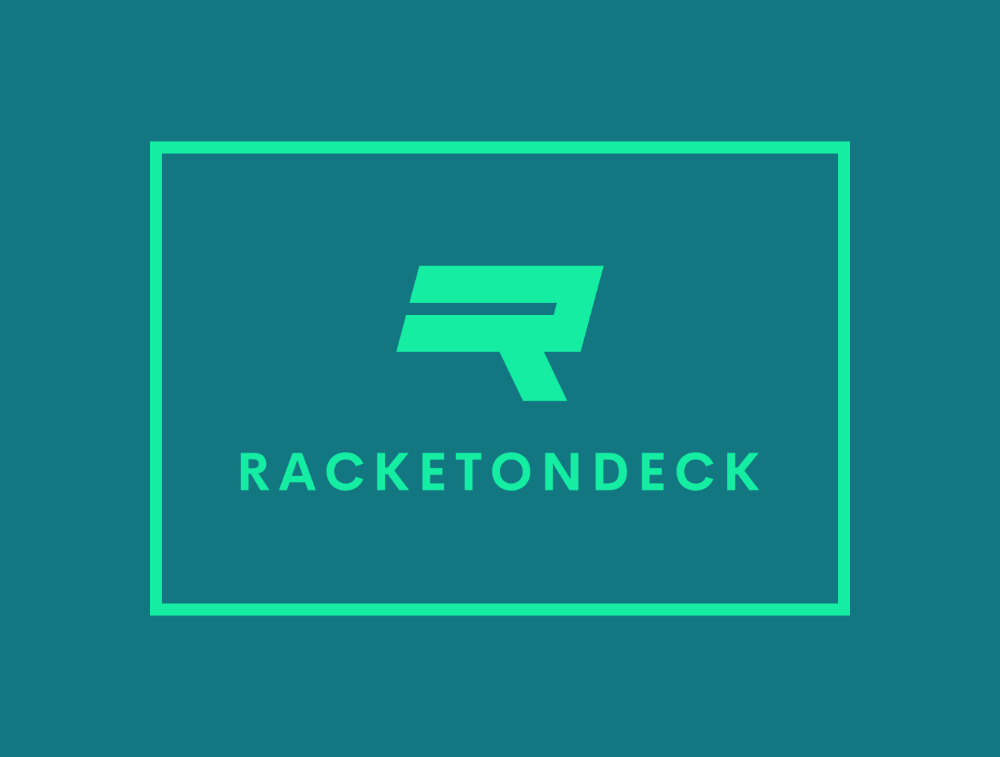

  

# RacketOnDeck

RacketOnDeck is a versatile platform designed to streamline the management of padel academies. From handling user accounts to managing court bookings, RacketOnDeck provides a comprehensive suite of tools to enhance the efficiency and experience of both academy staff and players. 🎾🏆📅

## Features 🛠️

- **User Accounts**: Manage user profiles, roles, and permissions with ease. 📝🔑
- **Authentication**: Secure login and authentication mechanisms to protect user data. 🔐
- **Staff Management**: Oversee staff members, their roles, and responsibilities. 👨‍🏫
- **Player Management**: Track player activities, progress, and profiles. 🧑‍🤝‍🧑
- **Court Management**: Maintain court details, conditions, and availability. 🏞️🎾
- **Bookings and Reservations**: Simplify the process of booking courts and managing reservations. 📅📋
- **Tournaments**: Organize and manage tournaments, including participant registrations and schedules. 🏆📅
- **Notifications**: Send notifications to users about important updates and events. 🔔📬
- **Membership Plans**: Create and manage membership plans and subscriptions. 🏷️📊
- **Event Management**: Plan and oversee events and special activities within the academy. 🎉📆
- **Feedback Collection**: Gather and manage feedback from users to improve services. 🗣️📋
- **Inventory Management**: Track and manage inventory and equipment. 📦🔄
- **Schedules**: Organize schedules for courts, instructors, and events. 📅🕒
- **Training Programs**: Develop and manage training programs for players. 🏋️‍♂️📑
- **News and Announcements**: Publish and manage news articles and announcements. 📰📣
- **Sponsorships**: Handle sponsorship deals and partnerships effectively. 🤝💼
- **Merchandise Sales**: Manage the sale of academy merchandise. 🛍️💰
- **Leaderboards**: Display player rankings and statistics. 🥇📊
- **Community Forums**: Facilitate discussions and knowledge sharing through forums. 💬🌐
- **Lost & Found**: Manage lost and found items within the academy. 🕵️‍♂️🔍
- **Surveys**: Create and analyze surveys to gather user opinions and insights. 📋🔍
- **Equipment Rentals**: Oversee the rental of equipment to players and members. 👕🏓
- **Volunteer Management**: Coordinate volunteers for events and programs. 🙋‍♂️📅
- **Data Analytics**: Analyze data to gain insights and improve academy operations. 📊📈
- **External Integrations**: Integrate with external systems and services for enhanced functionality. 🔗🔄

## Technologies Used 💻

RacketOnDeck employs modern technologies to ensure a seamless and efficient user experience:

- Frontend: `React`
- Backend: `Node.js`, `Express.js`
- Database: `MongoDB`, `PostgreSQL`

## Getting Started 🚀

Ready to enhance the management of your padel academy with RacketOnDeck?

1️⃣ **Sign Up**: Visit our website and create an account by providing your email address and choosing a password. 📝🔐

2️⃣ **Set Up Your Academy**: Enter details about your academy, including courts, staff, and players. 🏫📋

3️⃣ **Explore Features**: Familiarize yourself with the platform's features like court booking, player management, and event scheduling. 🔍📄

4️⃣ **Manage Your Academy**: Start using RacketOnDeck to manage all aspects of your academy efficiently. 🏆🎾

5️⃣ **Get Support**: If you need help, our support team is ready to assist you. Contact us via email, chat, or our support portal. 📞💬🛠️

## Contributing 🤝

We welcome contributions from developers, padel enthusiasts, and industry professionals. Whether you want to suggest new features, report bugs, or contribute code, your input is crucial to the evolution of RacketOnDeck.

## Feedback and Support 📣

Have questions, suggestions, or need assistance with RacketOnDeck? Our dedicated support team is here to help. Reach out to us via email, chat, or our support portal, and we'll work with you to resolve any issues and ensure you get the most out of the platform.

## Roadmap 🗺️

Interested in what's next for RacketOnDeck? Check out our Roadmap to see upcoming features, enhancements, and improvements. Your feedback is vital in shaping our future development, so feel free to share your ideas.

## License 📜

RacketOnDeck is licensed under the MIT License, giving you the freedom to use, modify, and distribute the software.

## Acknowledgments 🙏

We extend our heartfelt thanks to the padel community for their support, feedback, and enthusiasm. Together, we are revolutionizing the management of padel academies and enhancing the experience for players and staff alike.
